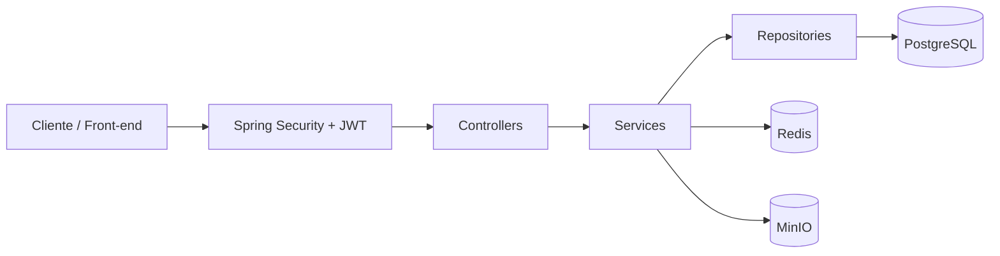

<div align="center">

# WEG Skills — Backend

API REST de uma plataforma de cursos online e assíncronos desenvolvida para o Centro de Treinamento de Clientes (CTC) da WEG.

[](https://www.oracle.com/java/technologies/javase/jdk21-archive-downloads.html)
[](https://spring.io/projects/spring-boot)
[](https://www.postgresql.org/)
[](https://www.docker.com/)
[](https://github.com/DenisLindner/WEG-Skills-Back-end)

</div>

## Sumário

- [Contexto](#contexto)
- [Objetivo](#objetivo)
- [Funcionalidades](#funcionalidades)
- [Arquitetura](#arquitetura)
- [Stack e bibliotecas](#stack-e-bibliotecas)
- [Autenticação e perfis](#autenticação-e-perfis)
- [Endpoints](#endpoints)
- [Fluxo de upload de mídias](#fluxo-de-upload-de-mídias)
- [Como rodar](#como-rodar)
- [Testes](#testes)
- [Colaboradores](#colaboradores)
- [Contato](#contato)

## Contexto

O **WEG Skills** é um MVP acadêmico desenvolvido nas disciplinas de Back-end e Front-end do curso de **Análise e Desenvolvimento de Sistemas**.

O projeto propõe uma plataforma de cursos para o **CTC (Centro de Treinamento de Clientes) da WEG**, permitindo que clientes, no papel de alunos, realizem treinamentos online de forma assíncrona. Nesta primeira versão, o conteúdo dos cursos é composto por videoaulas, sem quizzes ou outras atividades avaliativas.

Este repositório contém exclusivamente o **back-end** da aplicação. O front-end foi desenvolvido separadamente em outro repositório.

## Objetivo

Disponibilizar uma API capaz de sustentar o fluxo principal de uma plataforma de cursos, contemplando:

- autenticação e autorização de usuários;
- administração de instrutores;
- criação, organização e publicação de cursos;
- gerenciamento de módulos e videoaulas;
- armazenamento de imagens e vídeos;
- matrícula e acompanhamento de progresso;
- emissão e validação de certificados;
- avaliações e ranking de cursos.

## Funcionalidades

- Cadastro e login com autenticação JWT.
- Controle de acesso por perfil: `ADMIN`, `INSTRUCTOR` e `STUDENT`.
- Criação automática opcional de um administrador na inicialização.
- CRUD de cursos, módulos e aulas.
- Ordenação de módulos e aulas.
- Publicação de cursos inicialmente criados como rascunho.
- Upload multipart direto para o MinIO por meio de URLs assinadas.
- Imagens públicas para usuários, cursos e módulos.
- Vídeos privados com URLs temporárias para reprodução.
- Catálogo autenticado com paginação e busca por título.
- Matrícula de alunos em cursos publicados.
- Registro de conclusão das aulas e cálculo de progresso.
- Emissão de certificado após a conclusão do curso.
- Validação pública de certificados por código.
- Avaliações de cursos com notas de `0` a `10`.
- Ranking de cursos com cache no Redis.
- Rate limiting com Bucket4j e Caffeine.
- Monitoramento de saúde com Spring Boot Actuator.
- Documentação interativa com Swagger/OpenAPI.
- Migrations versionadas com Flyway.
- Testes automatizados com JUnit e Mockito.

## Arquitetura

O projeto utiliza **arquitetura em camadas**, separando as responsabilidades da aplicação entre controllers, services, repositories, mappers, DTOs e entidades.

```text
src/main/java/com/weg/weg_skills
├── config       # Segurança, cache, MinIO, Swagger e rate limit
├── controller   # Endpoints da API REST
├── dto          # Objetos de entrada e saída
├── enums        # Estados e perfis da aplicação
├── exceptions   # Exceções e tratamento global de erros
├── mapper       # Conversão entre entidades e DTOs
├── model        # Entidades JPA
├── projection   # Projeções de consultas
├── repository   # Acesso aos dados
└── service      # Regras de negócio
```



O desenvolvimento foi organizado com a metodologia **GitFlow**, utilizando branches específicas para funcionalidades, releases e correções.

## Stack e bibliotecas

| Tecnologia | Utilização |
|---|---|
| Java 21 | Linguagem principal |
| Spring Boot | Estrutura e inicialização da aplicação |
| Spring Web MVC | Construção da API REST |
| Spring Security | Autenticação JWT e autorização por perfil |
| Spring Data JPA | Persistência e acesso aos dados |
| PostgreSQL 16 | Banco de dados relacional |
| Flyway | Versionamento e execução das migrations |
| MinIO | Armazenamento de imagens e vídeos |
| Redis | Cache distribuído do ranking de cursos |
| Bucket4j | Controle do limite de requisições |
| Caffeine | Armazenamento local dos buckets do rate limit |
| Bean Validation | Validação dos dados recebidos pela API |
| Lombok | Redução de código repetitivo |
| Spring Boot Actuator | Health check e métricas da aplicação |
| Swagger / OpenAPI | Documentação interativa dos endpoints |
| Docker e Docker Compose | Build e orquestração dos serviços |
| JUnit, Mockito e H2 | Testes unitários e de integração |

## Autenticação e perfis

A API utiliza tokens **JWT Bearer**, assinados com `HS256` e com validade de uma hora. Após o login, envie o token no cabeçalho das rotas protegidas:

```http
Authorization: Bearer SEU_TOKEN_JWT
```

| Perfil | Permissões principais |
|---|---|
| `STUDENT` | Consultar o catálogo, matricular-se, assistir às aulas, acompanhar o progresso, avaliar cursos e emitir certificados |
| `INSTRUCTOR` | Criar e administrar os próprios cursos, módulos, aulas e mídias |
| `ADMIN` | Criar instrutores e administrar todos os cursos e conteúdos |

> O catálogo de cursos é autenticado por decisão do projeto. Apenas o ranking, a validação de certificados, a autenticação e os endpoints de documentação e saúde são públicos.

## Endpoints

Todos os endpoints utilizam o prefixo:

```text
http://localhost:8080/api
```

As tabelas abaixo apresentam um resumo das rotas. Os contratos completos de entrada e saída podem ser consultados no [Swagger](http://localhost:8080/api/docs).

### Autenticação

| Método | Endpoint | Acesso | Descrição |
|---|---|---|---|
| `POST` | `/auth/register` | Público | Cadastra um aluno |
| `POST` | `/auth/login` | Público | Autentica um usuário e retorna o JWT |

### Usuários

| Método | Endpoint              | Acesso      | Descrição                                    |
|---|-----------------------|-------------|----------------------------------------------|
| `GET` | `/users/me`           | Autenticado | Retorna o perfil atual                       |
| `GET` | `/users/admin/instructor`            | `ADMIN`     | Retorna uma lista de instrutores             |
| `POST` | `/users/instructor`   | `ADMIN`     | Cadastra um instrutor                        |
| `POST` | `/users/me/images/upload` | Autenticado | Gera um ticket para upload da foto de perfil |
| `PATCH` | `/users/me`           | Autenticado | Atualiza o perfil atual                      |
| `PATCH` | `/users/me/password`  | Autenticado | Altera a senha atual                         |
| `DELETE` | `/users/me`           | Autenticado | Exclui a própria conta                       |
| `DELETE` | `/users/instructor/{id}`             | `ADMIN`     | Exclui a conta de um instrutor               |

### Cursos

| Método | Endpoint | Acesso | Descrição |
|---|---|---|---|
| `POST` | `/courses` | `ADMIN` ou `INSTRUCTOR` | Cria um curso |
| `POST` | `/courses/{id}/images/upload` | `ADMIN` ou `INSTRUCTOR` | Gera um ticket para upload da imagem do curso |
| `GET` | `/courses` | Autenticado | Lista os cursos publicados |
| `GET` | `/courses/title?title={title}` | Autenticado | Pesquisa cursos publicados pelo título |
| `GET` | `/courses/top-courses` | Público | Lista os cursos com mais matrículas e suas avaliações |
| `GET` | `/courses/private` | `ADMIN` ou `INSTRUCTOR` | Lista os cursos do instrutor |
| `GET` | `/courses/private/title?title={title}` | `ADMIN` ou `INSTRUCTOR` | Pesquisa os cursos do instrutor pelo título |
| `GET` | `/courses/admin` | `ADMIN` | Lista todos os cursos para administração |
| `GET` | `/courses/{id}` | Autenticado | Retorna os detalhes de um curso |
| `GET` | `/courses/{id}/progress/me` | Autenticado | Retorna o progresso do usuário no curso |
| `PATCH` | `/courses/{id}` | `ADMIN` ou `INSTRUCTOR` | Atualiza parcialmente um curso |
| `PATCH` | `/courses/{id}/publish` | `ADMIN` ou `INSTRUCTOR` | Publica um curso |
| `PUT` | `/courses/{id}/certificate` | Autenticado | Emite o certificado de um curso concluído |
| `DELETE` | `/courses/{id}` | `ADMIN` ou `INSTRUCTOR` | Exclui um curso |

### Módulos

| Método | Endpoint | Acesso | Descrição |
|---|---|---|---|
| `POST` | `/modules` | `ADMIN` ou `INSTRUCTOR` | Cria um módulo |
| `POST` | `/modules/{id}/images/upload` | `ADMIN` ou `INSTRUCTOR` | Gera um ticket para upload da imagem do módulo |
| `GET` | `/modules/course/{courseId}` | Autenticado | Lista os módulos de um curso |
| `GET` | `/modules/{id}` | Autenticado | Retorna um módulo pelo ID |
| `PATCH` | `/modules/{id}` | `ADMIN` ou `INSTRUCTOR` | Atualiza parcialmente um módulo |
| `PATCH` | `/modules/reposition` | `ADMIN` ou `INSTRUCTOR` | Reordena os módulos de um curso |
| `DELETE` | `/modules/{id}` | `ADMIN` ou `INSTRUCTOR` | Exclui um módulo |

### Aulas

| Método | Endpoint | Acesso | Descrição |
|---|---|---|---|
| `POST` | `/lessons` | `ADMIN` ou `INSTRUCTOR` | Cria uma aula |
| `POST` | `/lessons/{id}/videos/upload` | `ADMIN` ou `INSTRUCTOR` | Gera um ticket para upload do vídeo |
| `GET` | `/lessons/module/{moduleId}` | Autenticado | Lista as aulas de um módulo |
| `GET` | `/lessons/{id}` | Autenticado | Retorna a aula e a URL temporária do vídeo |
| `PATCH` | `/lessons/{id}` | `ADMIN` ou `INSTRUCTOR` | Atualiza parcialmente uma aula |
| `PATCH` | `/lessons/reposition` | `ADMIN` ou `INSTRUCTOR` | Reordena as aulas de um módulo |
| `PUT` | `/lessons/{id}/completion` | Autenticado | Marca uma aula como concluída |
| `DELETE` | `/lessons/{id}` | `ADMIN` ou `INSTRUCTOR` | Exclui uma aula |

### Mídias

| Método | Endpoint | Acesso | Descrição |
|---|---|---|---|
| `POST` | `/medias/{mediaId}/course/{courseId}/complete` | Criador do upload | Confirma o upload da imagem de um curso |
| `POST` | `/medias/{mediaId}/module/{moduleId}/complete` | Criador do upload | Confirma o upload da imagem de um módulo |
| `POST` | `/medias/{mediaId}/lesson/{lessonId}/complete` | Criador do upload | Confirma o upload do vídeo de uma aula |
| `POST` | `/medias/{mediaId}/me/complete` | Autenticado | Confirma o upload da foto de perfil |

### Matrículas

| Método | Endpoint           | Acesso | Descrição                                             |
|---|--------------------|---|-------------------------------------------------------|
| `POST` | `/enrollments`     | Autenticado | Matricula o aluno em um curso publicado               |
| `GET` | `/enrollments/me`  | Autenticado | Lista as matrículas do usuário atual                  |
| `GET` | `/enrollments/me/{courseId}` | Autenticado | Busca uma matrícula do usuário atual pelo id do curso |

### Avaliações

| Método | Endpoint | Acesso | Descrição |
|---|---|---|---|
| `POST` | `/reviews` | Autenticado | Avalia um curso |
| `GET` | `/reviews/{courseId}` | Autenticado | Lista as avaliações de um curso |
| `GET` | `/reviews/me` | Autenticado | Lista as avaliações do usuário atual |
| `PATCH` | `/reviews/{id}` | Autor | Atualiza uma avaliação |
| `DELETE` | `/reviews/{id}` | Autor | Exclui uma avaliação |

### Certificados

| Método | Endpoint | Acesso | Descrição |
|---|---|---|---|
| `GET` | `/certificates/validate/{code}` | Público | Valida um certificado pelo código |

### Paginação e rate limit

As listagens paginadas aceitam os parâmetros `page` e `size`. Os valores padrão são `page=0` e `size=10`.

O rate limit permite:

- até **5 requisições por minuto** nas rotas de login e cadastro;
- até **100 requisições por minuto** nas demais rotas controladas.

As respostas incluem os cabeçalhos `X-RateLimit-Limit` e `X-RateLimit-Remaining`. Quando o limite é excedido, a API responde com `429 Too Many Requests` e o cabeçalho `Retry-After`.

## Fluxo de upload de mídias

Imagens e vídeos não são enviados através do corpo da API. O cliente realiza o upload diretamente para o MinIO:

1. Solicita um ticket de upload no endpoint correspondente ao recurso.
2. Envia o arquivo ao `uploadUrl` retornado, utilizando os campos presentes em `fields`.
3. Confirma o upload em um endpoint `/medias/.../complete`.

As imagens são armazenadas em um bucket público. Os vídeos permanecem privados e são disponibilizados por URLs assinadas com duração limitada quando o aluno acessa a aula.

## Como rodar

### Pré-requisitos

- [Git](https://git-scm.com/)
- [Docker Desktop](https://www.docker.com/products/docker-desktop/) com Docker Compose

### 1. Clone o repositório

```bash
git clone https://github.com/DenisLindner/WEG-Skills-Back-end.git
cd WEG-Skills-Back-end
```

### 2. Configure as variáveis de ambiente

Crie o arquivo `.env` a partir do exemplo:

```bash
cp .env.example .env
```

No PowerShell, utilize:

```powershell
Copy-Item .env.example .env
```

Edite o `.env` e substitua os valores de exemplo. As principais configurações são:

| Variável | Descrição |
|---|---|
| `POSTGRES_DB` | Nome do banco de dados |
| `POSTGRES_USER` | Usuário do PostgreSQL |
| `POSTGRES_PASSWORD` | Senha do PostgreSQL |
| `POSTGRES_HOST` | Host do PostgreSQL; no Docker Compose, utilize `postgres` |
| `REDIS_PASSWORD` | Senha do Redis |
| `REDIS_HOST` | Host do Redis; no Docker Compose, utilize `redis` |
| `REDIS_PORT` | Porta de acesso ao Redis |
| `MINIO_ROOT_USER` | Usuário administrativo do MinIO |
| `MINIO_ROOT_PASSWORD` | Senha administrativa do MinIO |
| `MINIO_PUBLIC_ENDPOINT` | Endereço público usado nas URLs assinadas |
| `MINIO_PUBLIC_BUCKET` | Bucket das imagens públicas |
| `MINIO_PRIVATE_BUCKET` | Bucket dos vídeos privados |
| `MINIO_CORS_ALLOWED_ORIGINS` | Origens autorizadas diretamente no MinIO |
| `JWT_SECRET` | Segredo Base64 com pelo menos 32 bytes para assinatura dos tokens |
| `CORS_ALLOWED_ORIGINS` | Origens autorizadas a consumir a API |
| `TRUSTED_PROXIES` | Proxies confiáveis para encaminhamento dos dados do cliente; pode permanecer vazio localmente |
| `ADMIN_NAME` | Nome do administrador inicial |
| `ADMIN_EMAIL` | E-mail do administrador inicial |
| `ADMIN_PASSWORD` | Senha do administrador inicial |

Você pode gerar um segredo JWT adequado com OpenSSL:

```bash
openssl rand -base64 32
```

> O administrador inicial somente será criado quando `ADMIN_EMAIL` e `ADMIN_PASSWORD` estiverem preenchidos.

### 3. Inicie a aplicação

```bash
docker compose up --build -d
```

O Docker Compose iniciará a API, o PostgreSQL, o Redis e o MinIO. Também criará automaticamente os buckets e aplicará as migrations do Flyway.

Confira o estado dos serviços:

```bash
docker compose ps
```

Para acompanhar os logs da API:

```bash
docker compose logs -f app
```

### 4. Acesse os serviços

| Serviço | Endereço |
|---|---|
| API | [http://localhost:8080/api](http://localhost:8080/api) |
| Swagger UI | [http://localhost:8080/api/docs](http://localhost:8080/api/docs) |
| OpenAPI JSON | [http://localhost:8080/api/v3/api-docs](http://localhost:8080/api/v3/api-docs) |
| Health check | [http://localhost:8080/api/actuator/health](http://localhost:8080/api/actuator/health) |
| MinIO API | [http://localhost:9000](http://localhost:9000) |
| MinIO Console | [http://localhost:9001](http://localhost:9001) |

### Encerrar os serviços

```bash
docker compose down
```

Para remover também os dados persistidos localmente:

```bash
docker compose down -v
```

> O comando acima exclui os volumes do PostgreSQL, Redis e MinIO. Utilize-o apenas quando quiser reiniciar o ambiente sem preservar os dados.

## Testes

Execute a suíte completa com o Maven Wrapper:

```bash
./mvnw clean verify
```

No Windows:

```powershell
.\mvnw.cmd clean verify
```

Os testes utilizam **JUnit**, **Mockito**, **Spring Security Test** e o banco em memória **H2**.

## Colaboradores

O WEG Skills foi desenvolvido de forma colaborativa por uma equipe dividida internamente entre back-end e front-end.

| Nome | GitHub |
|---|---|
| Denis Lindner | [@DenisLindner](https://github.com/DenisLindner) |
| Bruno Gustavo Kannenberg | [@okannenberg](https://github.com/okannenberg) |
| Emanuel Filipi Bueno de Souza | [@add095](https://github.com/add095) |
| Gustavo Schmitt Hatschbach | [@gustaaxz](https://github.com/gustaaxz) |
| Matheus Eichendorf | [@MatheusEich15](https://github.com/MatheusEich15) |

## Contato

**Denis Lindner**

- LinkedIn: [linkedin.com/in/denis-lindner](https://www.linkedin.com/in/denis-lindner/)
- GitHub: [github.com/DenisLindner](https://github.com/DenisLindner/)
- E-mail: [lindnerdenis19@gmail.com](mailto:lindnerdenis19@gmail.com)
